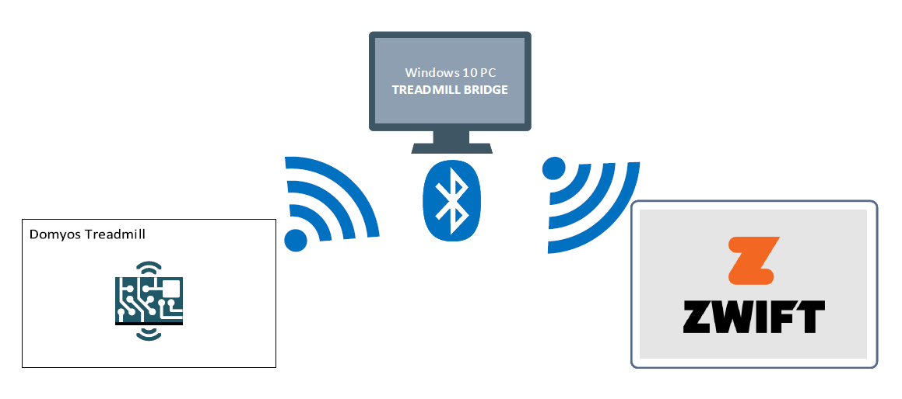

# TreadmillBridge
Virtual bridge to use a Domyos treadmills with Zwift (or other software using standard Bluetooth Low Energy channels).

Need **.NET Core 3.1** and works only with **Windows 10 1903**.

## **ATTENTION**
**START & STOP buttons are not working right now. To stop treadmill you have to kill application or disconnect Bluetooth!**

## Compatible devices
Tested with
- Domyos Climb

